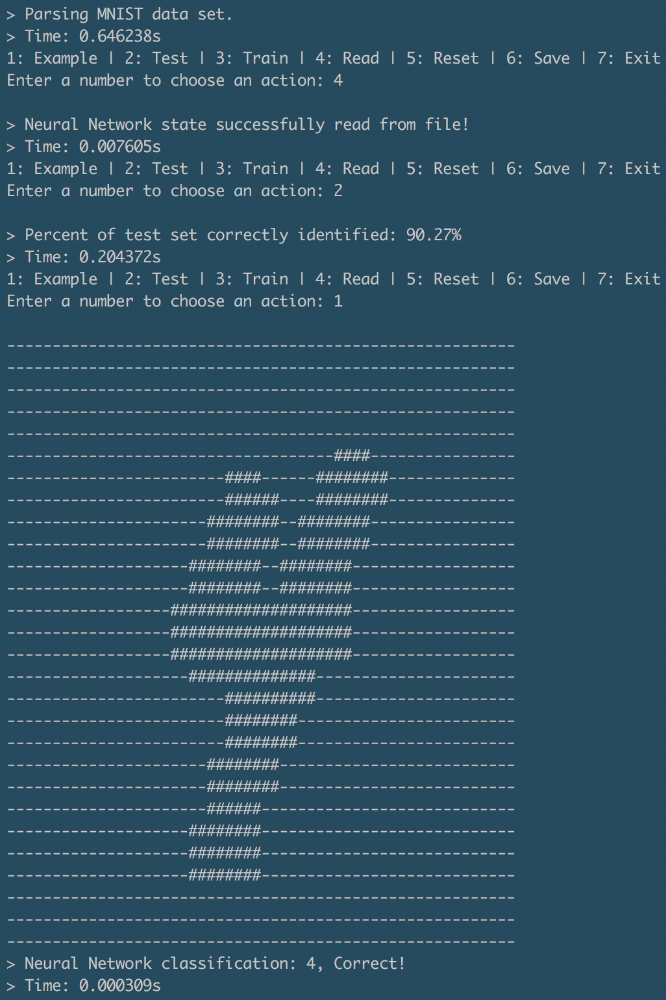

# Number-Recognition

Artificial Neural Network created from scratch to classify hand-written numbers.

Instead of using a neural network library like TensorFlow I opted to create everything from scratch, including the Matrix class for linear algebra, to learn more about how neural networks work.

It's a three layer artificial neural network using gradient descent to train the network and forward propagation to classify data. It's trained using the [MNIST database](http://yann.lecun.com/exdb/mnist/) of hand written numbers. The dataset contains 60000 hand written numbers used for training and 10000 used for testing after training. I also wrote a reader to read the data, which is not saved in a standard way.

The network classifies 90% of the testing set correctly.

#### How to use
1. Clone the repo
2. Via terminal cd into Number-Recognition/Neural-Network
3. Compile main.cpp: `clang++ -std=c++11 -Ofast main.cpp`
4. Execute the compiled file: `./a.out`
5. Follow the program instructions

